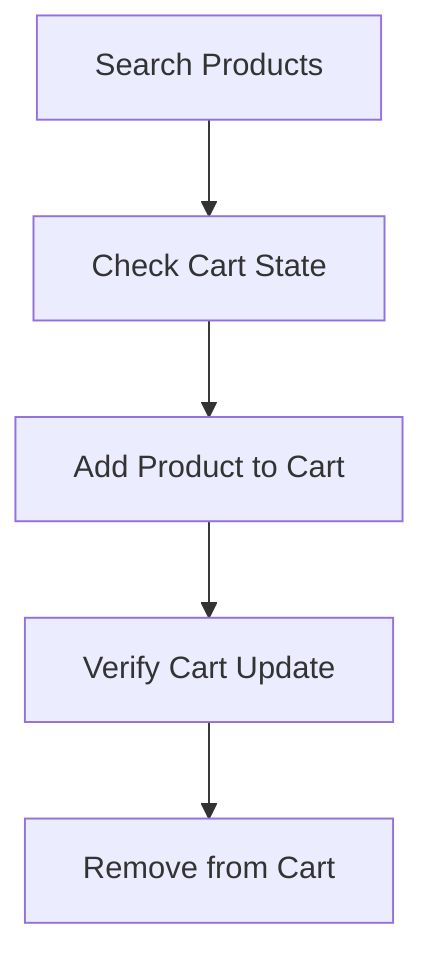

# Project Shoe Store - API Testing Suite

This project contains automated API tests for the EverShop e-commerce platform, specifically testing the shoe store functionality including search, cart management, and product operations.

## Overview

The test suite validates core e-commerce workflows using Postman collections and Newman for automated execution. The tests cover:

- Product search functionality
- Shopping cart operations (add, view, remove items)
- API response validation
- Data consistency checks

## Test Structure

### Collection: Project Shoe Store
- **Base URL**: `https://demo.evershop.io`
- **Total Requests**: 5
- **Test Scripts**: 10
- **Assertions**: 8

### Test Requests

1. **Search** - Product search with keyword validation
2. **Pre_cart** - Cart state verification before adding items
3. **Cart** - Add products to shopping cart
4. **post_cart** - Verify cart state after adding items
5. **Remove Cart** - Remove items from cart

## Test Flow



## Variables

The collection uses the following variables:

| Variable | Description | Example |
|----------|-------------|---------|
| `baseURL` | API base URL | `https://demo.evershop.io` |
| `search_item` | Random search term | `Nike React`, `Nike Air`, etc. |
| `skuName` | Product SKU | Auto-generated from search results |
| `preCount` | Cart quantity before adding | Numeric value |
| `productQuan` | Quantity to add | Random 1-5 |
| `removeApi` | Remove item API endpoint | Auto-extracted |

## Test Validations

### Search Request
- ✅ Status code validation (200)
- ✅ Success flag verification
- ✅ Product count validation based on search term
- ✅ Random SKU selection for cart operations

### Cart Operations
- ✅ Status code validation for all cart operations
- ✅ Quantity validation (actual vs expected)
- ✅ Cart state consistency
- ✅ API endpoint extraction for removal

## Prerequisites

- [Node.js](https://nodejs.org/) (v12 or higher)
- [Newman](https://www.npmjs.com/package/newman) CLI tool
- [Postman](https://www.postman.com/) (optional, for manual testing)

## Installation

1. Install Newman globally:
```bash
npm install -g newman
```

2. Clone or download this repository
3. Navigate to the project directory

## Running Tests

### Command Line Execution
```bash
newman run "Evershop.io Website test.json"
```

### With HTML Report Generation
```bash
newman run "Evershop.io Website test.json" -r htmlextra --reporter-htmlextra-export newman/test-report.html
```

### With Environment Variables
```bash
newman run "Evershop.io Website test.json" --env-var "baseURL=https://demo.evershop.io"
```

## Test Results

Based on the latest test execution:

- **Total Duration**: 2.5s
- **Average Response Time**: 426ms
- **Total Data Received**: 14.1KB
- **Success Rate**: 100%
- **Failed Tests**: 0
- **Skipped Tests**: 0

### Performance Metrics
- Search API: ~975ms average
- Cart API: ~316ms average  
- Add to Cart: ~257ms average
- Post Cart: ~363ms average
- Remove Cart: ~220ms average

## File Structure

```
├── Evershop.io Website test.json    # Postman collection file
├── newman/                          # Test reports directory
│   └── Project Shoe Store-*.html    # HTML test reports
└── README.md                        # This file
```

## Test Features

### Dynamic Data Generation
- Random search terms from predefined list
- Random product quantities (1-5)
- Dynamic SKU selection from search results
- Automatic API endpoint extraction

### Error Handling
- Graceful handling of empty cart scenarios
- Try-catch blocks for optional data extraction
- Fallback values for missing responses

### Assertions
- HTTP status code validation
- JSON response structure verification
- Business logic validation (quantities, counts)
- Cross-request data consistency

## API Endpoints Tested

| Method | Endpoint | Purpose |
|--------|----------|---------|
| GET | `/search?keyword={term}&ajax=true` | Product search |
| GET | `/cart?ajax=true` | View cart contents |
| POST | `/api/cart/mine/items` | Add item to cart |
| DELETE | `/api/cart/{cartId}/items/{itemId}?ajax=true` | Remove item |

## Contributing

1. Fork the repository
2. Create a feature branch
3. Add or modify test cases
4. Ensure all tests pass
5. Submit a pull request

## Troubleshooting

### Common Issues

1. **Connection Timeout**: Verify internet connection and API availability
2. **Test Failures**: Check if the demo site data has changed
3. **Variable Issues**: Ensure all required variables are set

### Debug Mode
Run tests with verbose output:
```bash
newman run "Evershop.io Website test.json" --verbose
```

## License

This project is for educational and testing purposes. Please respect the terms of service of the target API.

## Contact

For questions or issues, please refer to the Postman workspace:
- Workspace: RaiyanNasim's-Workspace
- Collection ID: 16ef0be5-2c95-4304-ac7c-a07ead9dd9fa
